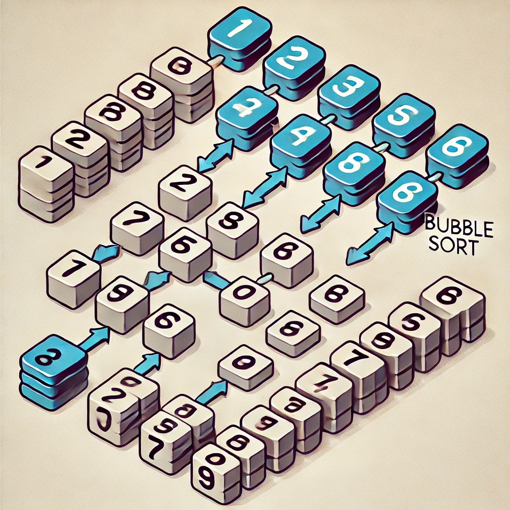

# Bubble Sort



[Português](#português) | [English](#english)

## Português

Bubble Sort é um algoritmo de ordenação simples que percorre repetidamente a lista, compara elementos adjacentes e os troca se estiverem na ordem errada.

### Como Funciona
1. Compara pares adjacentes de elementos
2. Se estiverem na ordem errada, troca suas posições
3. Repete o processo até que nenhuma troca seja necessária

### Complexidade
- Tempo: O(n²) em média e no pior caso
- Espaço: O(1)

### Exemplos
Array inicial: [64, 34, 25, 12, 22, 11, 90]
```
Passo 1: [34, 64, 25, 12, 22, 11, 90]
Passo 2: [34, 25, 64, 12, 22, 11, 90]
Passo 3: [34, 25, 12, 64, 22, 11, 90]
...
Final:   [11, 12, 22, 25, 34, 64, 90]
```

## English

Bubble Sort is a simple sorting algorithm that repeatedly steps through the list, compares adjacent elements and swaps them if they are in the wrong order.

### How it Works
1. Compare adjacent pairs of elements
2. If they are in the wrong order, swap their positions
3. Repeat the process until no swaps are needed

### Complexity
- Time: O(n²) on average and worst case
- Space: O(1)

### Examples
Initial array: [64, 34, 25, 12, 22, 11, 90]
```
Step 1: [34, 64, 25, 12, 22, 11, 90]
Step 2: [34, 25, 64, 12, 22, 11, 90]
Step 3: [34, 25, 12, 64, 22, 11, 90]
...
Final:  [11, 12, 22, 25, 34, 64, 90]
```

## Como Usar | How to Use

### Executar o código | Run the code
```bash
node BubbleSort.js
```

### Executar os testes | Run the tests
```bash
node --test BubbleSort.test.js
```

## Requisitos | Requirements
- Node.js (lts) v23.0.0 ou superior

## Estrutura do Projeto | Project Structure
```
BubbleSort/
├── BubbleSort.js      # Implementação | Implementation
├── BubbleSort.test.js # Testes | Tests
└── BubbleSort.md      # Documentação | Documentation
``` 